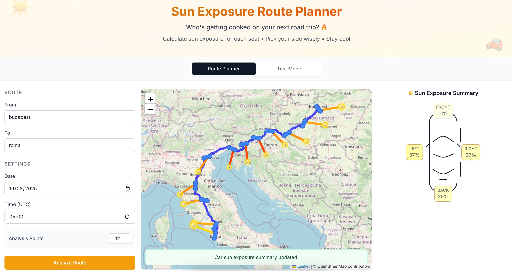
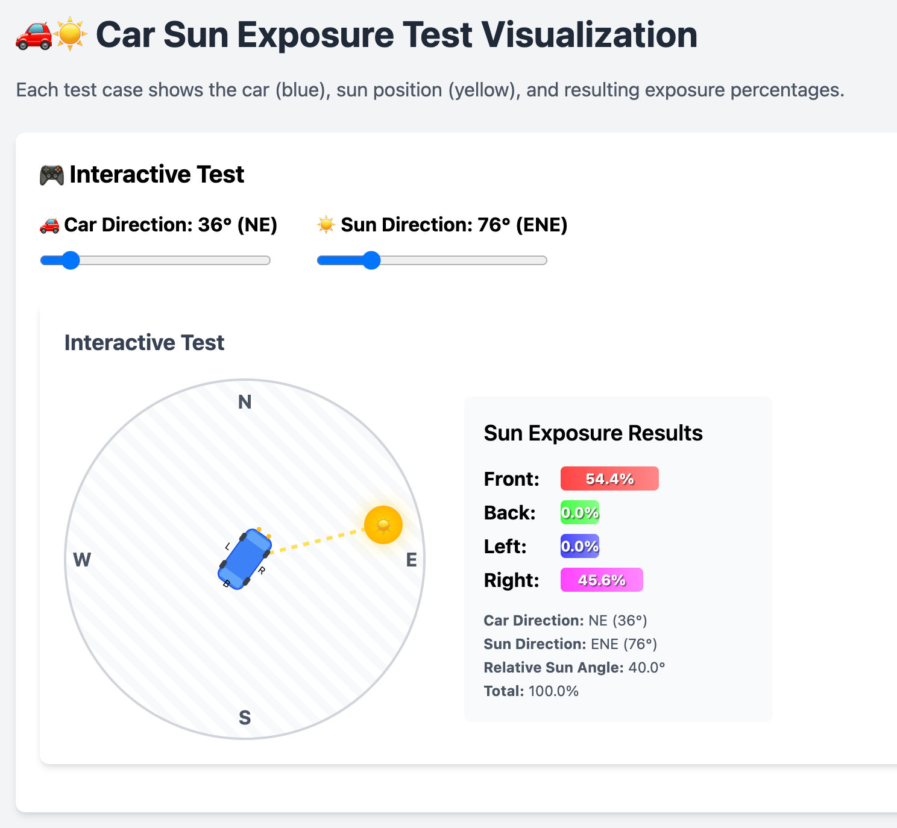

# Route Sun Exposure Visualizer

Analyze which side of your car gets hit by the sun during road trips.

## Calculations

### Car Sun Exposure Model

For each point along the route, we calculate the relative angle between the sun and car orientation:

**Relative Sun Angle:**
$$\theta_{rel} = (A_{sun} - B_{car} + 360°) \bmod 360°$$

Where $B_{car}$ is the car's bearing (travel direction).

**Side Exposure Calculation:**
Each car side's exposure is modeled as:

$$E_{side} = \max(0, \cos(\theta_{rel} - \theta_{side}))$$

Where $\theta_{side}$ represents the side's orientation:
- Front: $0°$
- Right: $90°$ 
- Back: $180°$
- Left: $270°$

The exposure values are normalized so that:
$$E_{front} + E_{back} + E_{left} + E_{right} = 1$$

This ensures the total sun energy hitting the car is conserved and distributed among the sides based on geometry.

## Interactive Sun Exposure Visualization

## Limitations

- **Perfect Weather**: Assumes clear skies with no atmospheric obstructions
- **Flat Terrain**: Ignores hills, mountains, trees, buildings, and other shadows
- **Simplified Car Model**: Car direction calculated from straight-line segments between route points
- **UTC Time Only**: All calculations use UTC time without local timezone adjustments
